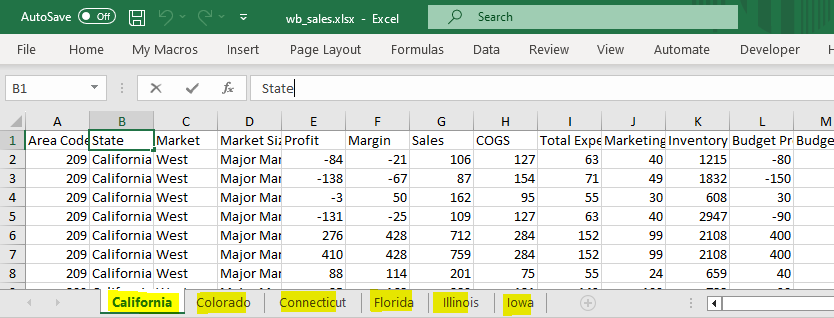

```{r setup, include=FALSE}
knitr::opts_chunk$set(echo = TRUE, message = FALSE, warning = FALSE)
```


## Loading the Required Libraries
```{r}
libs <- c('tidyverse','rio', 'readxl', 'writexl','here')

#another way to load libraries
invisible(lapply(libs, library, character.only = T))
```

## Set project root
```{r, echo=TRUE}
here::set_here("C:/Users/MaangiJ/Documents/combining_files_in_R")
```

## Combining an Excel Workbook

An Excel workbook is a file with multiple sheets. It's common to work with such files in any work place. In our case, we will be dealing with a file that has similar columns across all the sheets. The goal is to combine all sheets into a single file quickly. 



There are many approaches, but I will use these two:

 * Using Rio, I would say this my favorite. Rio is a versatile R package that makes it easy to import data from various file formats, including Excel workbooks. It provides a simple and efficient method to read all sheets from an Excel workbook and combine them into a single data frame. This approach is straightforward and can save you time.
 * Using tidyverse. The tidyverse suite of packages provide powerful tools for data manipulation and transformation. By using these packages, you can read each sheet from the Excel workbook, process and clean the data if needed, and then combine the sheets into a unified dataset. This method offers more flexibility and allows you to perform additional data wrangling tasks if required.

## Using Rio
```{r}
wb_combined <- import_list("wb_sales.xlsx", rbind = T) 

# import_list reads and loads all the sheets in our workbook and rbind does the combining.

head(wb_combined, 2)

#Export your file
#write_xlsx(wb_combined,"C:/Users/MaangiJ/Downloads/wb_combined.xlsx")
```

## Using Tidyverse
```{r}
wb_2 <- excel_sheets("wb_sales.xlsx") %>% 
  map_df(~read_xlsx("wb_sales.xlsx",.))
```

Files combined by Rio will have an extra column showing the sheet number. You can also alter the second approach to include the sheet name in your column in your combined file.

##Combining Multiple Excel/csv files

```{r}
multi_combined <- dir("to_combine",full.names = T) %>% # lists all files in to_combine folder/directory
  map_df(read_excel)                                   # reads & combines all excel files. To read csv, use read_csv.

```

## Targetting Files with Specific Extentions with pattern.
```{r}
multi_combined <- dir("to_combine",pattern = '.xlsx',full.names = T) %>% 
  map_df(read_xlsx)
```

## Combining Specific Sheets from Multiple Excel Workbooks
Suppose you have a collection of several Excel workbooks stored in a folder named **reports**. Within each workbook, you'll find three sheets: *region*, *sales*, and *distributor*. Your primary objective is to consolidate the *sales* data from all workbooks into a single, unified dataset. To achieve this, you'll need to identify the sheet named *sales* programmatically using the code below.

```{r}
reports <- dir("reports",full.names = T) %>% 
  map_df(read_excel,sheet= "sales") # identifies the specific sheet
```


## Files with inconsistent column Types
Often,you might encounter files with inconsistent column data types. As a result, R won't be able to combine these files due to the discrepancies in column types. To address this issue, my workaround is to transform all columns into the character data type, combine the files, and then reassign the appropriate data types to the fields in the merged file.
```{r}
bom2 <- dir("my_files", full.names = T) %>% 
  map_dfr(~read_excel(.x) %>% 
            mutate(across(.fns = as.character))) %>% type_convert() # This line of code converts all fields to character type

```

## Files with inconsistent column Types, Specific Sheet
```{r}
abbep_c <- dir("my_files", full.names = T) %>% 
  map_dfr(~read_excel(.x,sheet = "sales" ) %>%  # identifies the specific sheet
            mutate(across(.fns = as.character))) %>% type_convert()
```


Note: If you are dealing with the aggregation of thousands of files, the **data.table** package would be the ideal and efficient choice.


